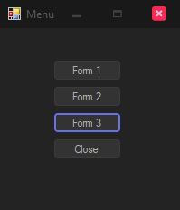
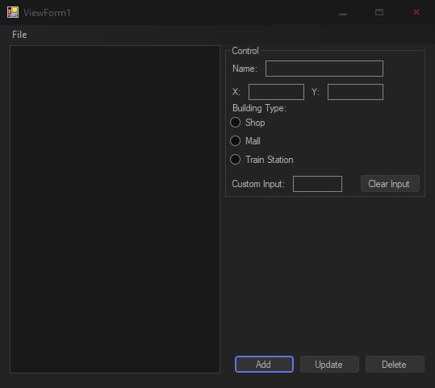
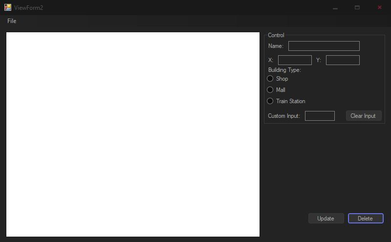
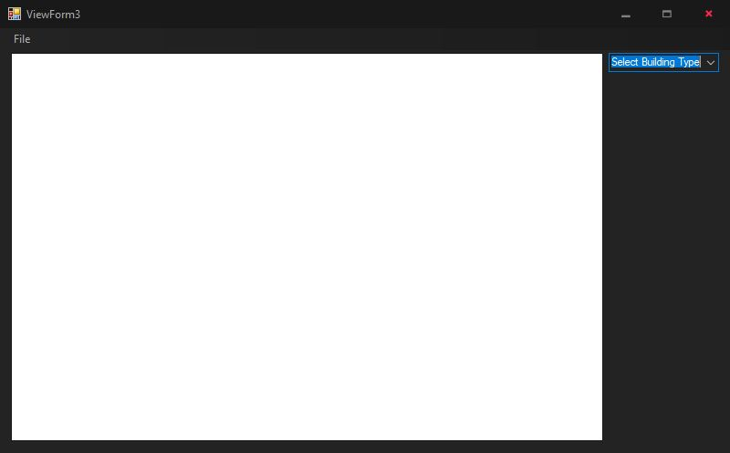

# Pseudo-GPS
An MVC Project for 7421 Assignment 1B. 

This project is meant to demonstrate the use of Super, Base Classes and various ViewForm Elements. 

It is done in the form of a simple GPS where the user is able to add a 'object' to the 'map' by inputting various types of data including Building Type, Location, Rating.

## Getting Started

Open the project in Visual Studio 2017 (should work in 2019), 

'Run' using the Debugger.

### Usage

Description of what each viewform does.

Each ViewForm has the ability to Save or Load data from the file menu.

- Use Buttons to display other viewforms or exit the application.

- Create, Update or Delete Buildings.
- ListBox to display displays.
- Control groupbox shows all required inputs to create or update a building.
- Delete only works when item in listbox is selected.
- Custom Input is tied to building type.
  - Train Station = Line
  - Mall = Capacity
  - Shop = Rating

- Controls are the same as viewform 1.
- The form displays building and allows the user to move it around and it automatically updates X and Y coordinates.

- This is a Read-Only view, and only displays the selected building type.

## Technologies

* Written in C#
* Made in Visual Studio 2017

## Authors

* **Shivneel Achari**
